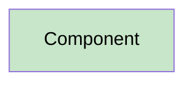

# 13 - Mermaid Standards

## Diagram-Type Rules
- Use `flowchart TB` for flow diagrams.
- Use `sequenceDiagram` only for time-ordered collaboration.
- Use `stateDiagram-v2` only for actual state machines.
- Do not select a Mermaid type merely to make duplicated content look different.

## Direction Rules
- Do not use `flowchart LR`, `graph LR`, or `graph TB` unless a documented user requirement overrides the standard.

## Semantic Rules
- Node IDs must be unique.
- Arrow labels must state the proven relationship.
- Data-flow arrows name data.
- Architecture arrows name dependency or ownership semantics.
- Integration arrows name protocol/operation/message semantics.
- Processing arrows name calls, branches, events, or persistence actions.

## Color Rules
Every light fill style includes `color:#000`; dark fills use `color:#fff`.

## State Diagram Rules
- Do not use style directives inside `stateDiagram-v2`.
- Use annotations for necessary explanation.
- Include `[*]` start and terminal states.

## Size and Readability
Split diagrams when labels become unreadable or unrelated scenarios are mixed. Splitting must create focused views, not duplicated views.

## Render Validation
Every generated Mermaid diagram must be validated by parsing it through a Mermaid renderer or equivalent syntax checker. A diagram that passes visual inspection but fails programmatic parsing is invalid.

### Validation Steps
1. Extract the Mermaid code block from the generated Markdown file.
2. Parse using `mermaid.parse()`, the Mermaid CLI (`mmdc --parse`), or an equivalent tool available in the execution environment.
3. If parsing fails, treat the diagram as a `FAIL` finding with severity `Critical` and confidence `100%`.
4. Correct the syntax error and re-parse until the diagram validates.
5. Record the render validation result (pass/fail, error message if applicable) in the audit trail.

### Fallback
If no Mermaid parser is available in the execution environment, the agent must:
- Validate syntax manually against the Mermaid grammar rules in this document.
- Flag the diagram with `RENDER_VALIDATION: MANUAL` in the audit trail.
- Note in the PR description that automated render validation was unavailable.
