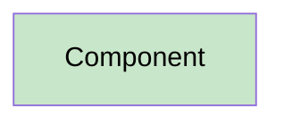

# 13 - Mermaid Standards

## Diagram-Type Rules
- Use `flowchart TB` for flow diagrams.
- Use `sequenceDiagram` only for time-ordered collaboration.
- Use `stateDiagram-v2` only for actual state machines.
- Do not select a Mermaid type merely to make duplicated content look different.

## Direction Rules
- Do not use `flowchart LR`, `graph LR`, or `graph TB` unless a documented user requirement overrides the standard.

## Semantic Rules
- Node IDs must be unique.
- Arrow labels must state the proven relationship.
- Data-flow arrows name data.
- Architecture arrows name dependency or ownership semantics.
- Integration arrows name protocol/operation/message semantics.
- Processing arrows name calls, branches, events, or persistence actions.

## Color Rules
Every light fill style includes `color:#000`; dark fills use `color:#fff`.

## State Diagram Rules
- Do not use style directives inside `stateDiagram-v2`.
- Use annotations for necessary explanation.
- Include `[*]` start and terminal states.

## Size and Readability
Split diagrams when labels become unreadable or unrelated scenarios are mixed. Splitting must create focused views, not duplicated views.
